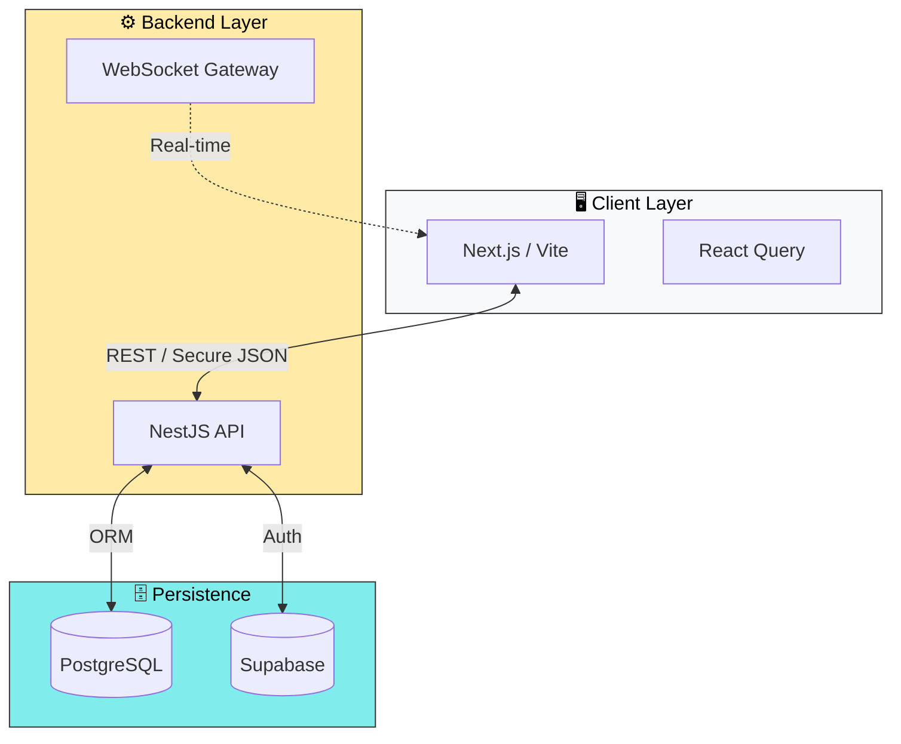

# Hi there, I'm Leonardo Zarelli 👋

> **Full Stack Analytics Engineer** | Building high-performance transactional systems.

I specialize in **complex business logic**, **data integrity**, and **real-time performance**.

 

---

### 🏗️ The Architecture

My systems are designed for scalability, security (JWT), and real-time performance (WebSockets).

---

Project,Tech Highlights
1. Social CRM Engine(Stealth Startup),Stack: NestJS WebSocketsSales automation ecosystem with JWT Guards and real-time lead distribution.
2. Ótica SZ POS(Retail System),"Stack: React PostgreSQLSolved complex ""Lenses vs. Frames"" inventory logic and scheduled reporting."
3. Carimbo SZ(Loyalty SaaS),Stack: Supabase SQLRetention platform with complex SQL aggregations and legacy data normalization.
---

   
  <h3>Let's Connect & Build</h3>
  <a href="https://www.linkedin.com/in/leonardo-zarelli/" target="_blank">LinkedIn</a>
  &nbsp; • &nbsp;
  <a href="https://leonardozarelli.substack.com" target="_blank">Substack</a>
  &nbsp; • &nbsp;
  <a href="https://www.youtube.com/@Leonardo_Zarelli" target="_blank">YouTube</a>
    

